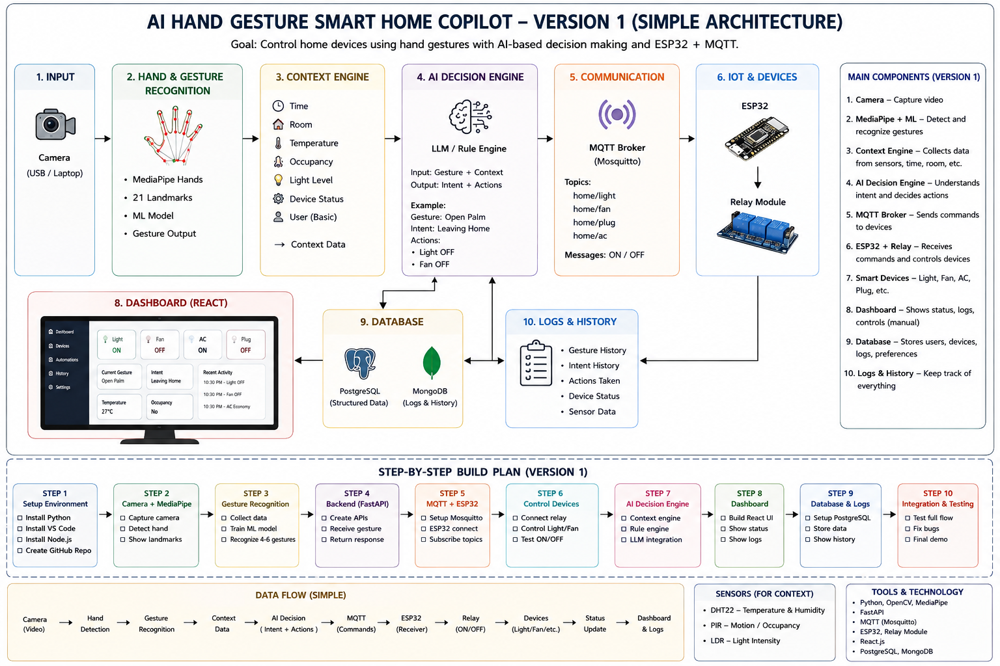

# AI Hand Gesture Smart Home Copilot

A smart home control system that allows users to operate connected devices through hand gestures, a mobile dashboard, and environmental sensing.

## Overview

AI Hand Gesture Smart Home Copilot is designed to make home automation more natural and flexible. Instead of depending on a single control method, the system supports both gesture-based input and manual device control from a phone or browser.

The key idea is simple: sensor data provides context, not automatic control. For example, a high room temperature may be displayed to the user, but a fan should only turn on when the user explicitly chooses to trigger that action or enables a valid automation rule.

This first version focuses on building a reliable working system within the project timeline. More advanced features such as speech recognition can be planned for a future release.

## Project Roadmap



## Project Goals

### Version 1 features

- Hand gesture recognition using a camera
- Smart device control with an ESP32
- Mobile-friendly web dashboard
- Manual control from a phone
- MQTT communication between backend and ESP32
- Temperature and humidity monitoring
- Device state and activity tracking
- Basic context-aware recommendations

### Core objective

Build a complete and reliable pipeline from user input to real device control.

---

## System Architecture

The system supports two main command paths.

### 1) Gesture-based control

```text
User Hand
   ↓
Camera
   ↓
OpenCV
   ↓
MediaPipe Hands
   ↓
Gesture Recognition
   ↓
Backend
   ↓
MQTT
   ↓
ESP32
   ↓
Connected Device
```

The camera captures frames, MediaPipe detects the hand and landmarks, and the recognition module classifies the gesture. The backend validates the action and sends the corresponding command through MQTT to the ESP32, which then controls the connected device.

### 2) Dashboard-based control

```text
Phone Browser
   ↓
Web Dashboard
   ↓
Backend API
   ↓
MQTT
   ↓
ESP32
   ↓
Connected Device
```

This mode is useful when the user is not near the camera or prefers direct manual control.

> During development, the phone and backend machine should be on the same local network. Use the laptop or desktop’s local IP address instead of localhost on mobile devices.

---

## Gesture Control Design

Version 1 uses a small number of reliable gestures instead of trying to support a large set.

| Gesture | Purpose | Example Action |
| --- | --- | --- |
| Open Palm | Shutdown / Leaving Mode | Turn selected devices off |
| Closed Fist | Activate | Turn a selected device or mode on |
| Thumb Up | Confirm | Confirm a pending action |
| Victory Sign | Work Mode | Activate the user’s work setup |

Each gesture has a clear meaning, and uncertain gestures should not trigger commands.

---

## Sensor Data and Context Awareness

Sensors provide environmental information, but they should not automatically control devices unless a valid automation rule is configured.

### Primary sensor for Version 1

- DHT22

The DHT22 measures:

- Temperature
- Humidity

Example values:

- Temperature: 34°C
- Humidity: 60%

This information can be displayed in the dashboard and used as context for recommendations.

```text
Room temperature is high
   ↓
System shows the data
   ↓
User decides whether to turn on the fan
```

Correct logic:

```text
Sensor Data ≠ Automatic Command
```

A high temperature alone should not activate the fan automatically. User intent remains important.

Additional sensors such as PIR or LDR may be added later if needed, but they are not required for the first working version.

---

## Decision Flow

The backend receives data from different sources and validates it before sending commands.

```text
Hand Gesture ─────┐
                  │
Mobile Dashboard ─┼──→ Backend / Validation ──→ MQTT ──→ ESP32
                  │
Sensor Data ──────┘
```

### Role of each source

- Gesture: expresses user intent
- Dashboard: provides direct manual control
- Sensors: provide environmental information
- Backend: validates and processes commands
- MQTT: transfers messages
- ESP32: executes hardware actions

---

## Core Components

### Hardware

#### ESP32
Acts as the main IoT controller. It connects to Wi‑Fi, reads sensor data, receives MQTT commands, and controls connected devices.

#### DHT22
Used to read temperature and humidity values.

#### Relay Module
Used to switch electrical devices safely when relay-based control is required.

#### LEDs / Demo Devices
Used during development and testing to simulate real device behavior safely.

### Software

#### OpenCV
Used to access and process the camera feed.

#### MediaPipe Hands
Used to detect the user’s hand and identify landmarks for gesture recognition.

#### Gesture Recognition Module
Uses hand landmark information to classify predefined gestures.

#### FastAPI
Acts as the backend API layer for receiving commands, validating requests, managing device states, publishing MQTT messages, and serving dashboard data.

#### MQTT
Used for communication between the backend and ESP32.

#### React
Used to build the web dashboard so users can:

- View device status
- Turn devices on or off
- View temperature and humidity
- Trigger device modes
- Review recent activity

---

## Technology Stack

### Frontend

- React
- HTML
- CSS
- JavaScript

### Backend

- Python
- FastAPI

### Computer Vision

- OpenCV
- MediaPipe Hands

### IoT and Communication

- ESP32
- MQTT

### Sensors

- DHT22

### Optional tools

- Docker
- Git and GitHub

Docker is useful for development and deployment, but it should not block the first working version of the system.

---

## System Flow

```text
                         USER
                       /     \
                      /       \
           Hand Gesture     Phone Dashboard
                |                  |
                v                  v
             Camera           Web Interface
                |                  |
                v                  v
      OpenCV + MediaPipe     API Request
                |                  |
                +--------> Backend <--------+
                            ^
                            |
                         DHT22
                    Temperature / Humidity
                            |
                            v
                    Command Validation
                            |
                            v
                           MQTT
                            |
                            v
                          ESP32
                       /          \
                      v            v
                   Light          Fan
```

---

## Development Plan

### Phase 1: Basic hardware setup

- Set up the ESP32
- Connect an LED or demo device
- Test Wi‑Fi connectivity
- Test MQTT communication

Goal: send a command from software and control a physical output.

### Phase 2: Backend and MQTT

- Create the FastAPI backend
- Connect the backend to the MQTT broker
- Define device control APIs
- Test command flow with the ESP32

Goal: create a reliable backend-to-ESP32 pipeline.

### Phase 3: Hand detection

- Connect the camera
- Use OpenCV to capture frames
- Integrate MediaPipe Hands
- Display and test hand landmarks

Goal: reliably detect a hand.

### Phase 4: Gesture recognition

- Define Version 1 gestures
- Implement gesture detection logic
- Add confidence checks
- Connect recognized gestures to backend commands

Goal: convert gestures into reliable commands.

### Phase 5: Mobile dashboard

- Build the React interface
- Display device states
- Add ON/OFF controls
- Add temperature and humidity display

Goal: allow manual control from a phone.

### Phase 6: Sensor integration

- Connect the DHT22 to the ESP32
- Read temperature and humidity
- Send sensor data to the backend
- Display the data on the dashboard

Goal: add environmental context.

### Phase 7: Full system integration

- Connect gesture input
- Connect dashboard control
- Connect sensor data
- Route everything through the backend
- Send final commands through MQTT to the ESP32

Goal: unify all modules into one working system.

### Phase 8: Testing and documentation

- Test each gesture repeatedly
- Test dashboard commands
- Test MQTT communication
- Test ESP32 reconnect behavior
- Test invalid commands
- Record demonstrations
- Prepare project documentation

Goal: ensure the system is stable and well documented.

---

## Version 1 Success Criteria

Version 1 will be considered successful when all of the following are true:

- The camera reliably detects the predefined gestures
- Gestures trigger valid commands
- The dashboard can control devices manually
- Commands are transmitted through MQTT
- The ESP32 receives and executes commands correctly
- Device states are visible on the dashboard
- Temperature and humidity are displayed correctly
- The complete system works on a local network

---

## Future Enhancements (Version 2)

After Version 1 is stable, additional features can be introduced.

### Possible features

- Speech recognition
- Voice commands
- Combined gesture and speech input
- User preferences
- Personalized automation
- More advanced context awareness

```text
Hand Gesture ──┐
               │
Speech Input ──┼──→ Intent / Backend ──→ MQTT ──→ ESP32
               │
Dashboard ─────┘
```

Speech recognition should be added as another input method without rebuilding the entire IoT system.

---

## Summary

This project combines computer vision, IoT, and web control into a flexible smart home system. It supports gesture-based interaction, manual phone control, and environmental monitoring while keeping the first version realistic, reliable, and achievable within the project timeline.

---

## Project Principle

The system should remain simple, stable, and reliable.

The priority for Version 1 is:

```text
Reliable Input
      ↓
Correct Command
      ↓
Reliable Communication
      ↓
Correct Device Action
```

Advanced features should only be introduced after the core pipeline is working properly.

---

## Repository Structure

```text
AI-Hand-Gesture-Smart-Home-Copilot/
├── frontend/                 # React dashboard
├── backend/                  # FastAPI application
├── gesture-recognition/      # OpenCV and MediaPipe code
├── esp32/                    # ESP32 firmware
├── docs/                     # Documentation and diagrams
├── mini_project_mind_map.png # Project roadmap image
├── README.md
└── .git/
```

---

## Current Status

Version 1 is currently under development.

The immediate focus is on building the core pipeline:

```text
Camera / Dashboard
        ↓
      Backend
        ↓
       MQTT
        ↓
      ESP32
        ↓
   Demo Devices
```

Once this pipeline is stable, gesture recognition and sensor-based context features can be added step by step.

---

## Project Developed By

| Name |
| --- |
| Rachit Saxena |
| Raghav Agarwal |
| Mukul Kumar |

---
